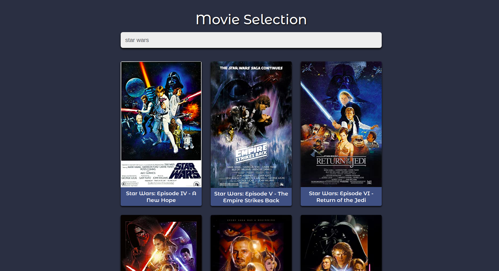
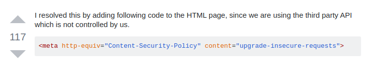

# Movie Selection (React)



## Structure

```
Project
│   README.md
│   package.json
|   package-lock.json
|
└─── public
│      │
│      └─── index.html
|
|
└─── src
      └─── index.js
      └─── App.js
      │
      └─── components
      │        └─── popup
      │        └─── results
      |        └─── search
      └─── scss
  
               
``` 
### Fixed http request:


## Available Scripts

In the project directory, you can run:

### `npm start`

Runs the app in the development mode.<br />
Open [http://localhost:3000](http://localhost:3000) to view it in the browser.

The page will reload if you make edits.<br />
You will also see any lint errors in the console.
